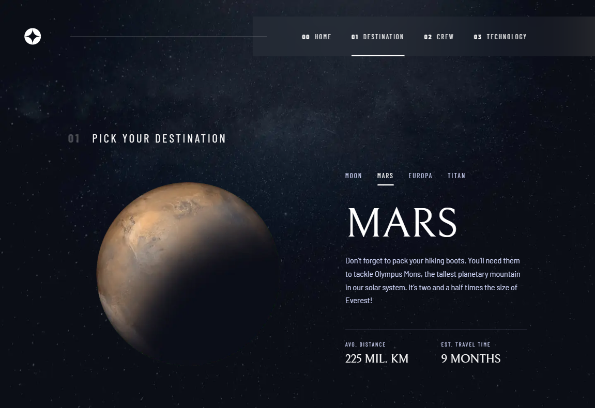
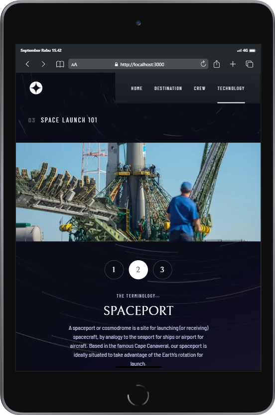
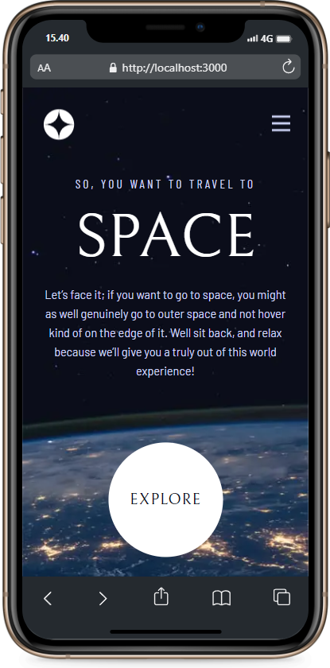

# Frontend Mentor - Space tourism website solution

This is a solution to the [Space tourism website challenge on Frontend Mentor](https://www.frontendmentor.io/challenges/space-tourism-multipage-website-gRWj1URZ3). Frontend Mentor challenges help you improve your coding skills by building realistic projects. 

## Table of contents

- [Frontend Mentor - Space tourism website solution](#frontend-mentor---space-tourism-website-solution)
  - [Table of contents](#table-of-contents)
  - [Overview](#overview)
    - [The challenge](#the-challenge)
    - [Screenshot](#screenshot)
    - [Links](#links)
    - [Built with](#built-with)
    - [What I learned](#what-i-learned)
    - [Continued development](#continued-development)
  - [Author](#author)

## Overview

### The challenge

Users should be able to:

- View the optimal layout for each of the website's pages depending on their device's screen size
- See hover states for all interactive elements on the page
- View each page and be able to toggle between the tabs to see new information

### Screenshot

This is a screenshot of the website with the desktop screen based on the design (1440px x 900px)


<div style="display:flex; justify-content:center; column-gap:3rem">

  <div style="text-align:center;">

  Tablet screen (768px x 1024px)
  
  </div>

  <div style="text-align:center;">

  Mobile screen (375px x 667px)
  
  </div>

</div>

Even though the above is responsive for several screens, I can't guarantee it can be optimal on all devices, so please contact me if it's messy on your device.

### Links

- Solution URL: [Frontend Mentor Solution](https://your-solution-url.com)
- Live Site URL: [Zoel Space Tourism](https://zoel-space-tourism.vercel.app/)

### Built with

- [Typescript](https://www.typescriptlang.org)
- [Next.js](https://nextjs.org/) - React framework
- [Styled Components](https://styled-components.com/) - For styling
- [Framer Motion](https://www.framer.com/) - For animation

### What I learned

I learned many things of techstack i've used above especially for Typescript, for example create a function with typescript syntax :

```ts
const sumTwoNumber = (x: number, y: number): number => {
  return x + y;
}
```

That's very useful when i developing this project, although i don't know too much yet about the various ways of writing types and will continue to develop my knowledge of typescript.

### Continued development

In the future, I will continue to use typescript and styled-components for styling because those are quite comfortable to me to use when I develop this project.

## Author

- Website - [Zulmy Azhary](https://zulmy-azhary.vercel.app)
- Frontend Mentor - [@zulmy-azhary](https://www.frontendmentor.io/profile/zulmy-azhary)
- Instagram - [@zulmyazhary_](https://www.instagram.com/zulmyazhary_)